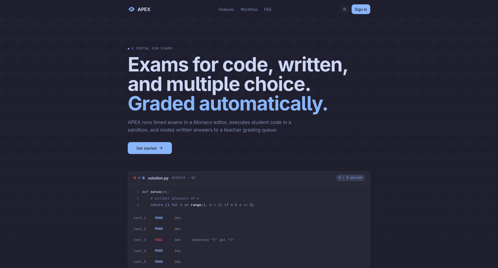
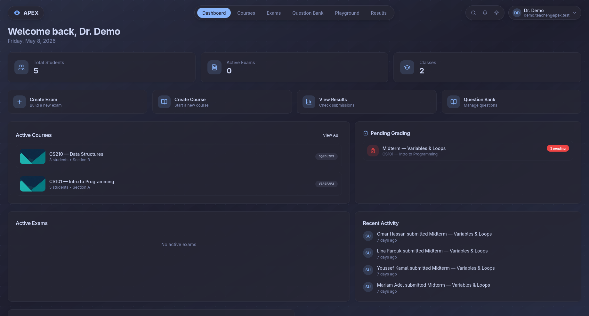
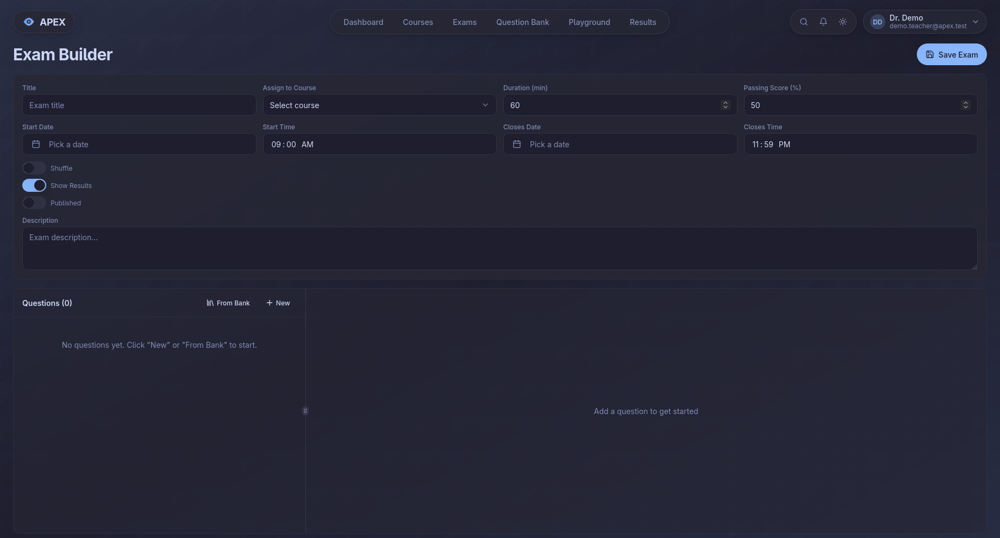
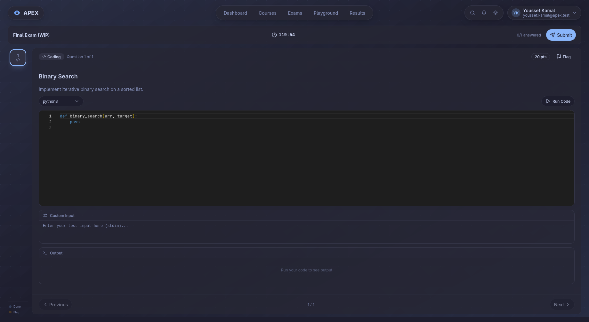
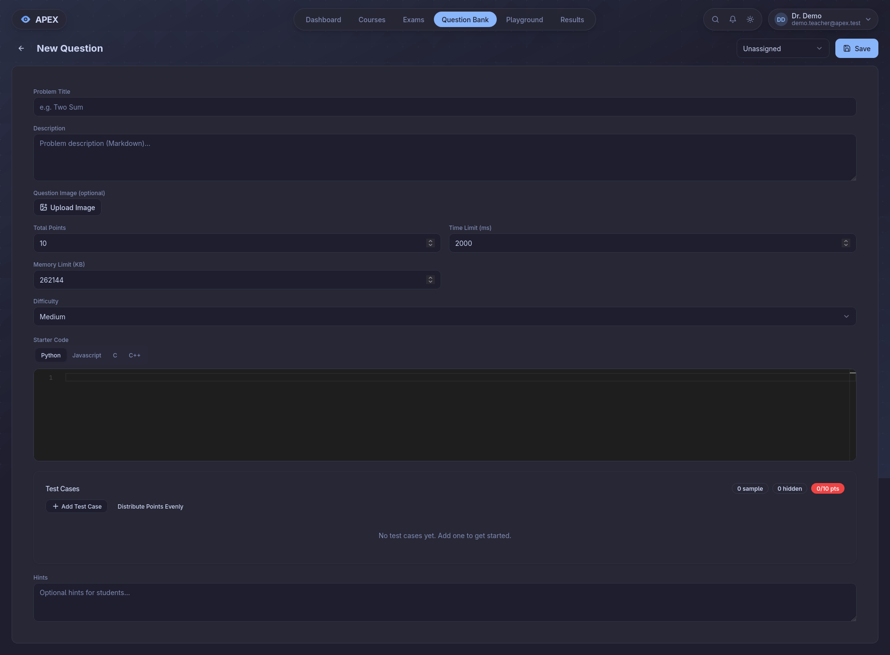
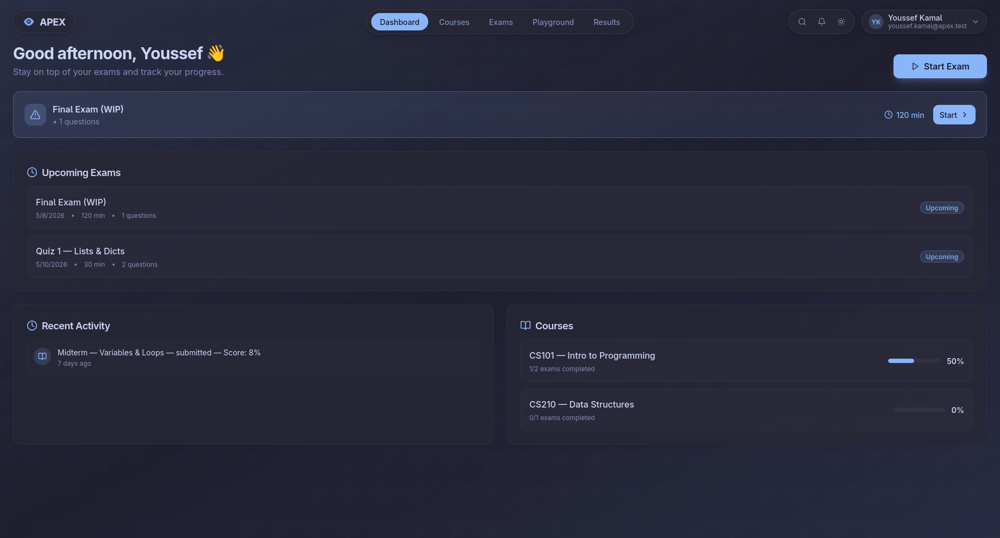

# APEX

> Exam, grading, and live-coding portal for classrooms. Go + Gin backend, React + Vite frontend, PostgreSQL store, Judge0 sandbox for code execution.

[](go.mod)
[](frontend/package.json)
[](frontend/package.json)
[](frontend/package.json)
[](docker-compose.yml)
[](.github/workflows/ci.yml)
[](LICENSE)
[](#contributing)

APEX lets teachers build mixed-format exams (coding, MCQ, written), assign them to classes, auto-grade code against test cases, and manually grade written answers. Students join classes by invite code, take timed exams in a Monaco editor, see live sample-test feedback, and review their results.

---

## Table of Contents

- [Screenshots](#screenshots)
- [Project Status](#project-status)
- [Features](#features)
- [Architecture](#architecture)
- [Tech Stack](#tech-stack)
- [Quick Start](#quick-start)
- [Demo Data & Logins](#demo-data--logins)
- [Configuration](#configuration)
- [Project Layout](#project-layout)
- [Data Model](#data-model)
- [API Reference](#api-reference)
- [Auth & Roles](#auth--roles)
- [Code Execution & Grading](#code-execution--grading)
- [Background Jobs](#background-jobs)
- [Database Migrations](#database-migrations)
- [Development](#development)
- [Testing](#testing)
- [Deployment](#deployment)
- [Troubleshooting](#troubleshooting)
- [Related Artifacts](#related-artifacts)
- [Contributing](#contributing)
- [Security](#security)
- [License](#license)

---

## Screenshots

| Landing / Sign-in | Teacher Dashboard |
|---|---|
|  |  |

| Exam Builder | Live Coding (Monaco + Judge0) |
|---|---|
|  |  |

| Question Bank | Student Dashboard |
|---|---|
|  |  |

More screenshots live in [`presentation/screenshots/`](presentation/screenshots/) (`analytics-chart.png`, `auth-signin.png`, `demo-poster.png`) and, with figure captions, in the thesis under [`book/figures/screenshots/`](book/figures/screenshots/).

---

## Project Status

APEX is a graduation project (Menoufia University, Electronics & Communications). It is feature-complete for the classroom workflow described above and runs in production-style Docker, but a few rough edges remain that are worth flagging up front rather than hiding:

- **Auth has no rate limiting.** Bcrypt cost 10 is the only brake on credential stuffing. Front the API with a WAF / rate limiter in production.
- **Password minimum is 6 characters.** Raise this before exposing the instance to the public internet.
- **Submission grading is fire-and-forget.** `judge0.Grade(...)` runs in a bare goroutine — a process crash mid-grade leaves submissions stuck in `running`. There is no worker queue / retry yet.
- **Exam auto-submit on timeout is client-side only.** When the countdown hits zero the exam-taking UI submits the attempt; there is no server-side sweep that force-submits an abandoned in-progress attempt if the student's browser is closed at expiry.
- **SPA stores the JWT in `localStorage`.** No CSRF surface because there are no cookies, but an XSS would lift the token. Trade-off chosen for a simpler deploy; switch to `httpOnly` cookies + same-site if you harden it.
- **Test coverage is focused, not comprehensive.** The backend ships stdlib unit tests for pure logic in five packages (`config`, `judge0`, `auth`, `class`, `middleware`) — token/claim handling, output normalization, invite-code generation, DSN building, JWT/role middleware — and the frontend ships one sanity test. These are targeted pure-logic tests, not full end-to-end or handler coverage.

> The `seed` demo-data binary is **not** committed — it is a local build artifact (`/seed` is git-ignored). Build it on demand with `go build -o seed ./cmd/seed` or just run `go run ./cmd/seed`.

---

## Features

**Teacher**
- Class management with invite codes, cover images, member roster, member removal.
- Exam builder: coding / MCQ / written, per-question points, difficulty, hints, time/memory limits, image attachments, tags.
- Question bank with folders for reuse across exams.
- Draft vs published exams; publishing requires `start_time` to be set. Shuffle questions; show-results-after toggle; per-exam passing score.
- Assign exams to one or many classes.
- Auto-grading via Judge0 with normalized output diffing; manual grading queue for written answers (with teacher feedback + score override).
- Announcements per class with attachments; notification fan-out to enrolled students.
- Dashboard, results explorer, pending-grading queue, class stats.
- Grade-announcement gating: optionally block announcements until all manual grading is complete.
- Exam preview: view any exam exactly as students see it before publishing.

**Student**
- Join classes via 8-char invite code; leave class; see assigned exams.
- Timed exam attempts with server-side autosave (`PUT /student/exams/:id/autosave`), resume, and shuffled question order.
- Monaco editor with multi-language run / submit and sample-test feedback.
- Results review per attempt with per-test breakdown and teacher feedback.
- Profile, notifications, help page.

**Platform**
- JWT auth, password reset by email (one-time SHA-256-hashed token, 1 h expiry), Google Identity Services sign-in.
- Email + in-app reminders for upcoming exams (T-60 min in-app, T-60 min email, T-0 email — column-deduped, idempotent across restarts).
- Idempotent legacy SQL migrations gated in front of GORM `AutoMigrate`, plus a parallel versioned `golang-migrate` track (`internal/database/migrations/sql/`) with a real `0001` baseline that builds the full schema from an empty database when `SKIP_AUTOMIGRATE=true`, and owns all incremental changes thereafter (see [ORM_RULES.md](ORM_RULES.md)).
- `/healthz` liveness endpoint and a `--healthcheck` self-probe so the shell-less distroless Docker image can health-check itself.

---

## Architecture

```
┌───────────────────┐    HTTPS/JSON     ┌──────────────────────┐
│  React + Vite SPA │ ────────────────▶ │  Gin REST API (Go)   │
│  (Monaco editor)  │ ◀──────────────── │  /api/* + /healthz   │
└───────────────────┘                   └──────────┬───────────┘
                                                   │
                          ┌────────────────────────┼─────────────────────────┐
                          │                        │                         │
                          ▼                        ▼                         ▼
                  ┌─────────────┐          ┌──────────────┐         ┌────────────────┐
                  │ PostgreSQL  │ ◀──┐     │  Judge0 CE   │         │ SMTP (optional)│
                  │  (GORM)     │    │     │  sandbox     │         │ password reset │
                  └─────────────┘    │     └──────────────┘         │ exam reminders │
                          ▲          │                              └────────────────┘
                          │          │
                  ┌───────┴──────┐   │     ┌────────────────────────┐
                  │ cmd/migrate  │   └─────│ reminder goroutine     │
                  │ (golang-     │         │ (1-min tick, in-app +  │
                  │  migrate)    │         │  email exam reminders) │
                  └──────────────┘         └────────────────────────┘
```

The backend is a single Gin process. Routes split into `public` (no auth) and `protected` (JWT middleware); role-scoped subgroups (`teacher`, `student`) are enforced by `middleware.RequireRole`. A background goroutine (`internal/reminder`) ticks every minute for exam reminders. Code grading (`internal/judge0`) runs in fire-and-forget goroutines spawned from the exam-submit handler. In production, schema changes are owned by the `cmd/migrate` binary; the same Docker image ships all three binaries (`apex`, `migrate`, `seed`).

---

## Tech Stack

| Layer            | Choice                                                            |
|------------------|-------------------------------------------------------------------|
| Backend language | Go 1.25.3                                                         |
| HTTP             | `gin-gonic/gin` 1.12, `gin-contrib/cors`                          |
| ORM              | `gorm.io/gorm` 1.31 + `gorm.io/driver/postgres`                   |
| Migrations       | `golang-migrate/migrate/v4` (versioned SQL) + idempotent in-code SQL pass |
| Auth             | `golang-jwt/jwt/v5`, Google Identity Services (`google.golang.org/api/idtoken`), `golang.org/x/crypto/bcrypt` |
| DB               | PostgreSQL 16 (Docker, also Neon / Railway compatible via `DATABASE_URL`) |
| Sandbox          | Judge0 CE (default `https://ce.judge0.com`)                       |
| Frontend         | React 18, Vite 5, TypeScript 5, `@vitejs/plugin-react-swc`        |
| Package manager  | Bun (pinned to `1.1.38` in CI); npm works as a fallback           |
| UI               | Tailwind 3, shadcn/ui (≈30 Radix primitives), lucide-react        |
| Editor           | `@monaco-editor/react`                                            |
| Data             | `@tanstack/react-query` 5, `react-hook-form`, `zod`               |
| Routing          | `react-router-dom` 6                                              |
| Tests            | Go `testing` (stdlib unit tests) + `golangci-lint` (backend); Vitest 3 + Testing Library + jsdom (frontend) |
| Container        | Distroless `gcr.io/distroless/static-debian12:nonroot` (backend), `nginx:1.27-alpine` (frontend) |
| CI               | GitHub Actions: backend vet+test+lint, frontend lint+build+test, Docker smoke build |

---

## Quick Start

### Prerequisites
- Go 1.25+
- Bun 1.1.38 (recommended — matches CI) **or** Node 18+ with `npm` as a fallback
- Docker + Docker Compose (for the bundled Postgres / migrate / full stack) **or** an existing Postgres 16
- Optional: a reachable Judge0 instance (default uses public `ce.judge0.com`)

### One-shot local dev
```bash
./start.sh
```
This will:
1. Copy `.env.example` → `.env` if missing (you still need to set a real `JWT_SECRET` — see below).
2. `docker compose up -d --wait` to start Postgres (host port `5433` → container `5432`).
3. `go run main.go` on `:8080` and wait for it to become responsive.
4. `bun run dev` (or `npm run dev` if Bun is missing) on `:5173`.
5. Trap Ctrl+C and tear everything down.

Open http://localhost:5173 and sign up (or seed demo data — see below). The backend exposes `GET /healthz` for liveness checks.

> **`JWT_SECRET` is required**, must be ≥ 32 characters, and the placeholder literal `dev-secret-change-in-prod` is rejected. Generate one with `openssl rand -hex 32` and paste it into `.env` before starting.

### Manual
```bash
# 1. Postgres (host port 5433 → container 5432)
docker compose up -d postgres

# 2. Backend
cp .env.example .env
# edit .env: set JWT_SECRET to a strong random value
go mod download
go run main.go            # listens on $PORT (default :8080)

# 3. Frontend
cd frontend
bun install               # or: npm install
bun run dev               # http://localhost:5173
```

### Full stack in Docker
```bash
# Brings up postgres + migrate (one-shot) + backend + frontend (nginx).
JWT_SECRET=$(openssl rand -hex 32) docker compose up --build
# Frontend on http://localhost:8081, backend on http://localhost:8080.
```

---

## Demo Data & Logins

Load a rich, demo-ready dataset (teacher + 8 students, four classes, exams in every lifecycle state, a question bank, a pending-grading queue, announcements, and notifications):

```bash
go run ./cmd/seed            # seed once; exits early if demo data already present
go run ./cmd/seed -reset     # wipe existing @apex.test demo data first, then reseed
```

The reset is scoped to the `@apex.test` domain and never touches real accounts. All demo accounts share the password `demo1234`.

| Role    | Email                    | Password   | Notes |
|---------|--------------------------|------------|-------|
| Teacher | `ayman.omera@apex.test`  | `demo1234` | Owns all four classes, has a pending-grading queue |
| Student | `amr.samy@apex.test`     | `demo1234` | Main demo account: graded results, an upcoming exam, and one **live-now** exam to take |
| Student | `omar.hassan@apex.test`  | `demo1234` | Top scorer across classes |
| Student | `lina.farouk@apex.test`  | `demo1234` | CS101 written answer pending grade |
| Student | *(+5 more `@apex.test` students)* | `demo1234` | Varied score distributions |

Class invite codes (for the join-class flow): `CS101DEM`, `CS210DEM`, `CS330DEM`, `ECE240DM`.

---

## Configuration

All config is loaded from environment (`.env` is auto-loaded via `godotenv` in `config.init()`). Defaults shown; **`JWT_SECRET` has no default** and the app refuses to start without one.

### Backend (`config.Load()`)

| Variable             | Required | Default                  | Purpose                                                                              |
|----------------------|----------|--------------------------|--------------------------------------------------------------------------------------|
| `DATABASE_URL`       | prod     | *(unset)*                | Full Postgres URL (Neon / Railway). Takes precedence over `DB_*` for both app and `cmd/migrate`. |
| `DB_HOST`            | dev      | `localhost`              | Postgres host                                                                        |
| `DB_PORT`            | dev      | `5432`                   | Postgres port                                                                        |
| `DB_USER`            | dev      | `postgres`               | Postgres user                                                                        |
| `DB_PASSWORD`        | dev      | `postgres`               | Postgres password                                                                    |
| `DB_NAME`            | dev      | `apex`                   | Database name                                                                        |
| `DB_SSLMODE`         | no       | `disable`                | `require` for managed providers                                                      |
| `PORT`               | no       | `8080`                   | HTTP listen port (also read by the `--healthcheck` self-probe)                       |
| `SKIP_AUTOMIGRATE`   | prod     | *(unset → false)*        | Set to `true` in production to disable GORM `AutoMigrate` and build/evolve the schema solely from the versioned `golang-migrate` files (see [Database Migrations](#database-migrations)) |
| `JWT_SECRET`         | **yes**  | —                        | HS256 signing key, must be ≥ 32 chars, must not be the literal `dev-secret-change-in-prod` |
| `JUDGE0_URL`         | no       | `https://ce.judge0.com`  | Judge0 base URL — point at a self-hosted instance for production                     |
| `APP_URL`            | no       | `http://localhost:5173`  | Public frontend URL (used in password-reset email links and as a CORS origin)        |
| `ALLOWED_ORIGINS`    | no       | *(empty)*                | Comma-separated additional CORS origins; merged with `APP_URL`                       |
| `SMTP_HOST`          | no       | *(empty)*                | If empty, password-reset and reminder emails are logged to stdout instead of sent    |
| `SMTP_PORT`          | no       | `587`                    |                                                                                      |
| `SMTP_USER`          | no       | *(empty)*                |                                                                                      |
| `SMTP_PASS`          | no       | *(empty)*                |                                                                                      |
| `SMTP_FROM`          | no       | *(empty)*                | Envelope-from address                                                                |
| `GOOGLE_CLIENT_ID`   | no       | *(empty)*                | Google Identity Services web client ID; if empty, `POST /auth/google` returns 503    |

> **`MIGRATIONS_DIR`** (default `file://internal/database/migrations/sql`) is **not** part of `config.Load()` / the `Config` struct — it is read directly via `os.Getenv` by `cmd/migrate` (`cmd/migrate/main.go`) and by `RunSQLMigrations` (`internal/database/sqlmigrate.go`). Override it only for non-standard layouts (e.g. the versioned SQL files copied to a different path inside a container). See [Database Migrations](#database-migrations).

### Frontend (Vite build args)

| Variable                  | Default | Purpose                                                                |
|---------------------------|---------|------------------------------------------------------------------------|
| `VITE_API_URL`            | `/api`  | API base. Use `/api` when fronted by a single reverse proxy; an absolute URL when frontend and backend are on different origins. |
| `VITE_GOOGLE_CLIENT_ID`   | *(empty)* | Must match the backend's `GOOGLE_CLIENT_ID` for Google sign-in to work. |
| `VITE_GITHUB_URL`         | *(empty)* | Landing-page footer link.                                            |
| `VITE_CONTACT_EMAIL`      | *(empty)* | Landing-page contact link.                                           |

### Docker Compose extras

| Variable              | Default | Purpose                                                |
|-----------------------|---------|--------------------------------------------------------|
| `POSTGRES_HOST_PORT`  | `5433`  | Host port mapped to Postgres `5432` (host `5432` is often taken by a local Postgres). |

CORS is built from `APP_URL` + `ALLOWED_ORIGINS` at startup (see `internal/config/config.go`); you do not need to edit `internal/middleware/cors.go` to add an origin.

---

## Project Layout

```
.
├── main.go                       # Gin bootstrap; mounts every package's routes; --healthcheck self-probe
├── Dockerfile                    # multi-stage Go build → distroless static-debian12:nonroot
├── docker-compose.yml            # postgres + migrate (one-shot) + backend + frontend (nginx)
├── start.sh                      # one-shot local dev launcher
├── ORM_RULES.md                  # REQUIRED reading before any schema change
├── go.mod / go.sum
├── .golangci.yml                 # golangci-lint config
├── .github/workflows/            # ci.yml (vet/test/lint/build) + docker.yml (image smoke build)
├── cmd/
│   ├── migrate/                  # golang-migrate CLI wrapper (`migrate up|down|version|force`)
│   └── seed/                     # demo-data loader (build to a gitignored `./seed` if desired)
├── internal/
│   ├── config/                   # env loading, DSN, MigrateURL (+ config_test.go)
│   ├── database/                 # GORM init + legacy idempotent SQL migrations
│   │   └── migrations/sql/       # versioned NNNN_*.up.sql / .down.sql for golang-migrate
│   ├── middleware/               # CORS, JWT auth, role gating (+ auth_test.go)
│   ├── models/                   # GORM models (single source of truth for schema)
│   ├── auth/                     # signup, login, Google OAuth, password reset, account delete (+ handler_test.go)
│   ├── class/                    # CRUD, member removal, stats, cover image (+ invite_code_test.go)
│   ├── student/                  # student-scoped views (join, classes, exams, stats, performance)
│   ├── teacher/                  # teacher dashboard, pending-grading queue
│   ├── exam/                     # exam CRUD, assign, close/reopen, attempts (start/submit/autosave), results, reset
│   ├── problem/                  # exam problems + question bank (`is_bank`)
│   ├── testcase/                 # test cases per problem
│   ├── submission/               # sample-run, get, manual grade
│   ├── execute/                  # one-off code run (playground; not persisted)
│   ├── judge0/                   # client + grader (coding/MCQ/written) + attempt aggregator (+ grader_pure_test.go)
│   ├── folder/                   # bank-question folders
│   ├── announcement/             # per-class announcements + attachments
│   ├── notification/             # in-app notifications + helper for fan-out
│   ├── profile/                  # profile + change-password
│   ├── email/                    # SMTP wrapper (no-op stdout fallback when SMTP_HOST empty)
│   └── reminder/                 # 1-min background ticker for exam reminders (in-app + email)
├── frontend/
│   ├── Dockerfile                # Bun build → nginx:1.27-alpine runtime
│   ├── nginx.conf
│   ├── index.html
│   ├── vite.config.ts            # dev proxy /api → :8080
│   ├── vitest.config.ts
│   ├── tailwind.config.ts
│   ├── package.json (bun.lock)
│   └── src/
│       ├── main.tsx / App.tsx
│       ├── contexts/             # AuthContext, role gating
│       ├── components/           # shared UI (shadcn/ui + layout)
│       ├── features/             # auth, dashboard, exams, courses, grading,
│       │                         #   playground, results, settings, social, landing
│       ├── pages/                # Index, NotFound
│       ├── hooks/ lib/ assets/
│       └── test/                 # Vitest setup + sanity test
├── book/                         # LaTeX thesis (IEEE-standard XeLaTeX → main.pdf)
│   └── figures/                  # figure assets + captioned screenshots
└── presentation/                 # Defense slide deck (PPTX + HTML) + screenshots
```

---

## Data Model

15 GORM models map to 15 tables (see `internal/models/*.go` for full struct tags). Enums are application-enforced Go string columns, not Postgres enum types.

- **User** — `email` (unique), `password_hash` (hidden), `role` (`teacher` | `student`), `name`, optional `google_id` (for OAuth linking). `UserProfile` (1:1 via `user_id`) carries bio, avatar (base64 dataURL or URL), notification toggles, and per-teacher defaults.
- **Class** — owned by a teacher, joined by students via 8-char `invite_code` (unique). Fields: `cover_image`, `grades_announced`, `passing_threshold` (60), `block_announce_with_pending` (true). Membership via **ClassMember** (composite unique on `class_id + user_id`).
- **Exam** — owned by a teacher; `duration_minutes` (60), nullable `start_time`/`end_time`, `is_draft`, `is_practice`, `shuffle_questions`, `show_results_after` (true), `passing_score` (50). Assigned to one or many classes via **ExamClass**. Has many **Problem**. `reset_at` invalidates cached student attempts when a teacher destructively edits exam content. `reminder_sent_at` / `email_reminder1h_sent_at` / `email_reminder_start_sent_at` are dedup stamps for the reminder scheduler.
  > Although `start_time` is nullable at the Go level (`*time.Time`), `RunMigrations` backfills any legacy null to `created_at`, and publishing an exam requires it — so a persisted exam is effectively always `start_time`-populated.
- **Problem** — three types: `coding`, `mcq`, `written`. Belongs to an exam **or** to the question bank (`is_bank=true`, exam_id null). Optional `class_id` and `folder_id` (FK to folders, `ON DELETE SET NULL`) for bank organization. Coding problems have `TestCase` rows, `time_limit_ms` (2000), `memory_limit_kb` (262144), `starter_code`. MCQ uses `options` + `correct_option_ids` (JSONB) + `multiple_correct`. Written has `rubric`, `max_word_count` (500), `require_manual_grading`.
- **TestCase** — `input`, `expected_output`, `is_sample`, `points`, `order_index`.
- **ExamAttempt** — one row per (student, exam) (composite unique). Aggregates `score` across submissions (excluding `pending_review`); tracks `graded_notified` for one-shot notification; `draft_answers` (JSONB) + `draft_saved_at` hold the in-progress autosave payload (opaque to the server, cleared on submit).
- **Submission** — one row per answer. Status lifecycle: `pending` → `running` → one of `accepted`, `wrong_answer`, `compilation_error`, `time_limit_exceeded`, `runtime_error`, or `pending_review` (written, or an MCQ with no correct answers configured). Carries `score`, `passed_count`/`total_count`, `code`/`selected_options`/`text_answer`, `execution_time_ms`, `memory_kb`, optional `teacher_feedback`. **TestResult** rows hold per-test outcome.
- **Folder** — per-teacher grouping for bank questions.
- **Announcement** — per-class, with JSONB `attachments`. Fans out **Notification** rows to enrolled students.
- **Notification** — `type`, `title`, `description`, `link_to`, `read`; standalone (no FK associations).
- **PasswordResetToken** — SHA-256 `token_hash` (hex, unique, hidden), `expires_at`, `used_at`.

> Schema changes **must** follow [ORM_RULES.md](ORM_RULES.md) — never use `gorm:"default:X"` on existing tables for DDL. Add the column nullable, backfill, then constrain. Legacy in-code migrations live in `internal/database/migrations.go`; new changes belong in `internal/database/migrations/sql/NNNN_*.up.sql` / `.down.sql` (paired and idempotent). See [Database Migrations](#database-migrations) for how the two tracks interact.

---

## API Reference

Base URL: `http://localhost:8080/api`. Liveness: `GET /healthz` (no auth, no `/api` prefix, returns `{"status":"ok"}`). All protected routes require `Authorization: Bearer <jwt>`. Tokens are issued on signup/login and valid for 24 hours.

### Auth (`public`)
| Method | Path                       | Body / Notes                                                                            |
|--------|----------------------------|-----------------------------------------------------------------------------------------|
| POST   | `/auth/signup`             | `{name, email, password, role}` — `role` ∈ {`teacher`, `student`}, password ≥ 6 chars  |
| POST   | `/auth/login`              | `{email, password}`                                                                     |
| POST   | `/auth/forgot-password`    | `{email}` — always returns 200 to avoid enumeration                                     |
| POST   | `/auth/reset-password`     | `{token, new_password}`                                                                 |
| POST   | `/auth/google`             | `{id_token, role?}` — Google credential; returns `{needs_role: true}` if a new account is created without `role` |
| DELETE | `/auth/account`            | *(any authenticated user)* permanently delete own account (cascade in one transaction)  |

### Profile *(any authenticated user)*
| Method | Path                  |
|--------|-----------------------|
| GET    | `/profile`            |
| PUT    | `/profile`            |
| PUT    | `/profile/password`   |

### Classes *(teacher role)*
| Method | Path                                       |
|--------|--------------------------------------------|
| POST   | `/classes`                                 |
| GET    | `/classes`                                 |
| GET    | `/classes/:id`                             |
| PUT    | `/classes/:id`                             |
| DELETE | `/classes/:id`                             |
| GET    | `/classes/:id/stats`                       |
| DELETE | `/classes/:id/members/:userId`             |

### Student *(student role)*
| Method | Path                              |
|--------|-----------------------------------|
| POST   | `/student/classes/join`           |
| DELETE | `/student/classes/:id`            |
| GET    | `/student/classes`                |
| GET    | `/student/classes/:id`            |
| GET    | `/student/exams`                  |
| GET    | `/student/exams/:id`              |
| GET    | `/student/submissions`            |
| GET    | `/student/stats`                  |
| GET    | `/student/performance`            |
| POST   | `/student/exams/:id/start`        |
| PUT    | `/student/exams/:id/autosave`     |
| POST   | `/student/exams/:id/submit`       |

`GET /attempts/mine` — **any authenticated user** (not student-role-gated); filtered server-side to the caller's own attempts.

### Teacher *(teacher role)*
| Method | Path                          |
|--------|-------------------------------|
| GET    | `/teacher/dashboard`          |
| GET    | `/teacher/grading/pending`    |

### Exams *(teacher role)*
| Method | Path                          | Notes                                                  |
|--------|-------------------------------|--------------------------------------------------------|
| POST   | `/exams`                      |                                                        |
| GET    | `/exams`                      |                                                        |
| GET    | `/exams/:id`                  |                                                        |
| PUT    | `/exams/:id`                  | Publishing (`is_draft`→false) requires `start_time` set |
| DELETE | `/exams/:id`                  |                                                        |
| POST   | `/exams/:id/assign`           | Validates all `class_id`s belong to the calling teacher |
| POST   | `/exams/:id/close`            |                                                        |
| POST   | `/exams/:id/reopen`           |                                                        |
| GET    | `/exams/:id/results`          |                                                        |

### Problems *(teacher role)*
| Method | Path                              |
|--------|-----------------------------------|
| POST   | `/exams/:id/problems`             |
| GET    | `/problems`                       |
| POST   | `/problems/bank`                  |
| GET    | `/problems/:id`                   |
| PUT    | `/problems/:id`                   |
| DELETE | `/problems/:id`                   |
| POST   | `/problems/:id/test-cases`        |
| PUT    | `/test-cases/:id`                 |
| DELETE | `/test-cases/:id`                 |

### Folders *(any authenticated user; scoped per-owner)*
Folders are owned per user (`user_id` treated as `teacher_id`); there is no `RequireRole` on these routes, so any authenticated caller can manage their own folders.
| Method | Path                |
|--------|---------------------|
| GET    | `/folders`          |
| POST   | `/folders`          |
| PUT    | `/folders/:id`      |
| DELETE | `/folders/:id`      |

### Submissions
| Method | Path                              | Access / Notes                             |
|--------|-----------------------------------|--------------------------------------------|
| POST   | `/submissions/run`                | Any authed user; runs against **sample** test cases only (teacher owns problem, or student enrolled in an assigned class) |
| GET    | `/submissions/:id`                | Student (own) or teacher (exam owner)      |
| PUT    | `/submissions/:id/grade`          | **Teacher** (exam owner) only              |
| POST   | `/execute`                        | Any authed user; one-off playground run    |

### Announcements *(any authenticated user)*
Access control is enforced **inside the handlers** (class ownership for teachers, membership for students) via `user_id`, not by role middleware.
| Method | Path                                       |
|--------|--------------------------------------------|
| GET    | `/classes/:id/announcements`               |
| POST   | `/classes/:id/announcements`               |
| PUT    | `/announcements/:id`                       |
| DELETE | `/announcements/:id`                       |

### Notifications *(any authenticated user)*
| Method | Path                                  |
|--------|---------------------------------------|
| GET    | `/notifications`                      |
| GET    | `/notifications/unread-count`         |
| PUT    | `/notifications/:id/read`             |
| PUT    | `/notifications/read-all`             |

---

## Auth & Roles

- Passwords hashed with bcrypt (cost 10). JWTs are HS256, 24 h expiry, claims `{user_id, email, role, name, exp}`, signed with `JWT_SECRET` (≥ 32 chars, enforced at startup).
- Frontend stores the token in `localStorage` and sends `Authorization: Bearer <token>`. On 401 the client clears local state and redirects to `/auth`.
- `middleware.Auth` extracts the bearer token, enforces the HMAC signing method, validates it, and sets `user_id`, `email`, `role` on the Gin context (401 on any failure).
- `middleware.RequireRole("teacher" | "student")` gates feature subgroups (403 on wrong role): e.g. `/exams` is teacher-only, `/student/*` is student-only. Note that `/folders`, `/announcements`, `/notifications`, `/attempts/mine`, `/submissions/*`, `/execute`, and `/profile` are **not** role-gated — they are available to any authenticated user and scoped by ownership inside the handlers.
- Google sign-in: the frontend posts the Identity Services credential to `/auth/google` as `{id_token, role?}`. The backend verifies via `google.golang.org/api/idtoken` against `GOOGLE_CLIENT_ID`, then resolves the user by `google_id` → email (linking an existing account) → new account. If a new account is being created and the request omits `role`, the response is `{needs_role: true, email, name}` and the client must re-submit with a role.
- Password reset: `/auth/forgot-password` issues a `PasswordResetToken` containing a SHA-256 hash of a 32-byte random token, valid for 1 hour and single-use (`used_at`). Prior unused tokens for the same user are invalidated. If `SMTP_HOST` is empty, the link is **logged to stdout** for dev; otherwise it is emailed via `internal/email`.

---

## Code Execution & Grading

- `POST /execute` (playground) and `POST /submissions/run` (sample-test feedback inside the exam UI) send code to Judge0 and return stdout/stderr/time/memory. Neither persists a `Submission` row.
- Real grading is triggered server-side by `POST /student/exams/:id/submit`. During submission, a `Submission` row is created **per answer in a loop** (individual row failures are skipped, not rolled back — the loop is not transactional), then each is graded in a fire-and-forget goroutine dispatched by type (`Grade` for coding, `GradeMCQ`, `GradeWritten`). There is no worker queue or retry, so a backend crash mid-grade can leave a submission stuck in `running`.
  - **Coding:** each `TestCase` is sent to Judge0 with `input`. Output is normalized (CRLF/CR → LF, trailing whitespace per line stripped, surrounding whitespace trimmed) before an equality check. Judge0 status `3` (accepted) and `4` (wrong answer) both count as "ran". `score = passed_count / total_count * 100`. A coding problem with **zero** test cases is auto-marked `accepted` at 100.
  - **MCQ:** set equality of `correct_option_ids` vs `selected_options` — all-or-nothing, no partial credit. An MCQ with no correct answers configured is marked `pending_review` (can't fail a student on an unconfigured question).
  - **Written:** no automatic scoring — always starts as `pending_review`, awaiting manual grading.
  - **Aggregation** (`FinalizeAttempt`): waits until no submission is `pending`/`running`, then re-evaluates over the exam's full problem list weighted by `problem.points` (defaulting to 10 if ≤ 0). Skipped questions count `0` in the denominator; `pending_review` submissions are excluded from **both** numerator and denominator until graded, so an in-flight written grade doesn't depress the visible total. Once no `pending_review` remain, a single "Exam Graded" notification fires, deduped via `exam_attempts.graded_notified`.
- **Manual grading:** teachers pull pending answers from `GET /teacher/grading/pending` and submit a score via `PUT /submissions/:id/grade` (`{score, status, teacher_feedback}`), which re-runs the aggregator. Gated to the exam owner.
- **Sandbox:** there is no in-house sandbox — all untrusted code runs on the Judge0 instance. Base URL is set at startup via `judge0.Init(cfg.Judge0URL)`; point `JUDGE0_URL` at a self-hosted instance for production — the public `ce.judge0.com` is rate-limited and not for real classroom use.

**Supported languages** (`internal/judge0/client.go`):

| Identifier (frontend / API) | Judge0 language ID |
|-----------------------------|--------------------|
| `python` / `python3`        | 100                |
| `javascript` / `js`         | 102                |
| `typescript` / `ts`         | 101                |
| `java`                      | 91                 |
| `c`                         | 103                |
| `cpp` / `c++`               | 105                |

---

## Background Jobs

`internal/reminder/scheduler.go` runs as a goroutine started by `reminder.Start()` in `main.go`. After a 15-second warm-up it ticks every minute (each tick panic-recovered) and, for every published exam (`is_draft = false`), runs three sweeps:

1. **In-app reminder, T-60 min** — exams with `start_time ∈ (now, now+60m]` and `reminder_sent_at IS NULL`. Fans out a `Notification` to enrolled students whose profile has `notify_exam_reminders = true`. Stamps `reminder_sent_at`.
2. **Email, T-60 min** — exams with `start_time BETWEEN now+58m AND now+62m` and `email_reminder1h_sent_at IS NULL`. Filter: `notify_exam_email`. Stamps `email_reminder1h_sent_at`.
3. **Email, T-0** — exams with `start_time BETWEEN now-2m AND now+2m` and `email_reminder_start_sent_at IS NULL`. Same filter. Stamps `email_reminder_start_sent_at`.

All deduplication is column-based, so restarting the process cannot re-send. If `SMTP_HOST` is empty, the email sweeps log the message body to stdout instead of delivering.

> **Exam auto-submit is client-side.** The exam-taking UI submits the attempt when the countdown reaches zero. There is **no** server-side background job that force-submits an expired/abandoned in-progress attempt — a known limitation. The "Exam Graded" notification is emitted by the grading aggregator (see above), not by this scheduler.

---

## Database Migrations

APEX has two migration tracks; which one mutates schema depends on `SKIP_AUTOMIGRATE`.

**Local / dev (`SKIP_AUTOMIGRATE` unset or `false`):** `internal/database/database.go` runs three passes on every boot:

1. **`RunMigrations`** — explicit, idempotent SQL executed **before** `AutoMigrate` (each block gated by `tableExists()` so fresh DBs stay quiet). Use this for any change to an existing table (add column nullable, backfill, set NOT NULL / DEFAULT, drop FK, sweep orphans, drop legacy tables).
2. **`AutoMigrate`** — owned by GORM, over the 15 models. In dev this is what materializes the schema.
3. **`RunPostMigrations`** — runs after `AutoMigrate` so it can reference GORM-created tables (e.g. adds `fk_problems_folder` after `folders` exists, sweeping orphan refs first).

**Production (`SKIP_AUTOMIGRATE=true`):** `RunMigrations`, `AutoMigrate`, and `RunPostMigrations` are all skipped, and only the versioned files in `internal/database/migrations/sql/` run via `golang-migrate`. The same logic is exposed as a CLI in `cmd/migrate`:

```bash
go run ./cmd/migrate up                  # apply all pending migrations
go run ./cmd/migrate version             # current schema version
go run ./cmd/migrate down                # roll back one migration
go run ./cmd/migrate force <version>     # mark a version applied without running it (recovery only)
```

**Baseline.** `0001_init` is a **real baseline migration** — full DDL (all 15 core tables, sequences, constraints, and indexes) equivalent to a first-boot GORM `AutoMigrate`, generated by `pg_dump` of a freshly AutoMigrated Postgres 16 database. It was verified end-to-end with `golang-migrate`: `up` builds all 15 tables from an empty database and stamps version 1; `down` drops all 15 tables back to version 0. This means `SKIP_AUTOMIGRATE=true` can bootstrap a **from-scratch** production database on its own — no prior AutoMigrate run required. The versioned track owns the baseline (`0001`) **and** all incremental changes (`0002+`); GORM `AutoMigrate` is only used in the dev path.

**Adding a new migration:** put a paired `NNNN_name.up.sql` / `NNNN_name.down.sql` in `internal/database/migrations/sql/` (or wherever `MIGRATIONS_DIR` points). Both must be idempotent (`IF EXISTS` / `IF NOT EXISTS`) and `down` must reverse `up`. After adding, run `go run ./cmd/migrate up`, then `version`, then sanity-check row counts per Rule 4 of [ORM_RULES.md](ORM_RULES.md).

> See [ORM_RULES.md](ORM_RULES.md) for the incident that motivated this. **Never** add `gorm:"default:X"` to a struct field on an already-populated table without a matching SQL migration — it silently rewrites existing rows.

---

## Development

```bash
# Backend
go run main.go                     # dev
go build -o apex .                 # main binary
go build -o migrate ./cmd/migrate  # migration CLI
go build -o seed ./cmd/seed        # demo-data seeder (output is gitignored)
go vet ./...                       # static checks
golangci-lint run                  # full lint (matches CI)
go test ./... -race -count=1       # race-checked test run

# Frontend (in frontend/)
bun install                        # or: npm install
bun run dev                        # Vite dev server on :5173, proxies /api → :8080
bun run build                      # production bundle → dist/
bun run lint                       # ESLint
bun run preview                    # serve built bundle
bun run test                       # Vitest single run
bun run test:watch                 # Vitest watch mode
```

In dev the frontend hits the backend through the Vite proxy declared in `vite.config.ts` (`/api → http://localhost:8080`). In production the SPA is served by `nginx` and either calls a same-origin `/api` (default `VITE_API_URL=/api`, recommended) or a fully-qualified URL configured at build time.

---

## Testing

```bash
# Backend
go test ./... -race -count=1

# Frontend
cd frontend
bun run test                       # Vitest single run
bun run test:watch                 # watch mode
```

The backend ships **stdlib unit tests for pure, deterministic logic** — no database or network needed — in five packages:

| Package | File | Covers |
|---------|------|--------|
| `internal/config`     | `config_test.go`        | DSN assembly, `MigrateURL`, `getEnv` fallbacks, password-not-leaked-in-DSN ordering |
| `internal/judge0`     | `grader_pure_test.go`   | output normalization (CRLF/CR/whitespace), idempotency, pointer deref helper |
| `internal/auth`       | `handler_test.go`       | JWT token/claim generation & signature validation, reset-token SHA-256 hashing, email regex |
| `internal/class`      | `invite_code_test.go`   | invite-code length, alphabet, no-ambiguous-chars, distribution |
| `internal/middleware` | `auth_test.go`          | JWT `Auth` context wiring, bad-request rejection, RS256 rejection, `RequireRole` gating |

These are focused pure-logic tests, not end-to-end or full handler coverage — most HTTP handlers and DB paths are exercised manually and via the frontend, not automated. The frontend adds a Vitest + jsdom + Testing Library setup (`frontend/src/test/setup.ts`) with a single sanity test. The CI matrix runs both suites on every push, so expanding coverage does not require pipeline changes.

---

## Deployment

Both services ship as production-ready Docker images:

- **Backend** (`Dockerfile`) — multi-stage build, statically linked `CGO_ENABLED=0` Go binaries with `-trimpath -ldflags="-s -w"`, copied into `gcr.io/distroless/static-debian12:nonroot`. The image contains three binaries (`/app/apex`, `/app/migrate`, `/app/seed`) plus `/app/internal/database/migrations` for the migration files. Because the runtime image has no shell, the container `HEALTHCHECK` invokes `/app/apex --healthcheck`, which self-probes `GET /healthz` on `$PORT`.
- **Frontend** (`frontend/Dockerfile`) — Bun build, then `dist/` is served by `nginx:1.27-alpine` with a custom `nginx.conf`. `VITE_*` env vars are baked in at build time via Docker build args.
- **`docker-compose.yml`** wires the full stack — `postgres` (healthchecked) → `migrate` (one-shot, `restart: "no"`, depends on Postgres healthy) → `backend` (depends on `migrate` completing successfully) → `frontend`. The CI workflow `docker.yml` smoke-builds both images on every PR and push to `main`.

**Production checklist:**

- Generate a strong `JWT_SECRET` (`openssl rand -hex 32`) and set it via your orchestrator's secret store.
- Provide a managed Postgres 16 (Neon, Railway, RDS, etc.) and set `DATABASE_URL` (takes precedence over `DB_*` for both `apex` and `cmd/migrate`). Use `sslmode=require` for managed providers.
- Set `SKIP_AUTOMIGRATE=true` and run `migrate up` as a pre-deploy step — `0001_init` builds the full baseline schema from an empty database, and any `0002+` files apply incrementally (the bundled `migrate` compose service is the reference implementation).
- Run a Judge0 instance you control — the public `ce.judge0.com` is rate-limited and not for production.
- Configure `SMTP_*` and `APP_URL` so password-reset and exam-reminder emails resolve correctly. Without `SMTP_HOST` all emails silently fall back to stdout logging.
- Set `GOOGLE_CLIENT_ID` (backend) **and** `VITE_GOOGLE_CLIENT_ID` (frontend build arg) to the same web client ID; whitelist `APP_URL` in the Google Cloud Console.
- Front the SPA and API with HTTPS. Set `APP_URL` to the public origin and add any extra origins to `ALLOWED_ORIGINS`.
- Put a rate limiter / WAF in front of `/api/auth/*` (the app does not rate-limit itself).

---

## Troubleshooting

| Symptom                                                    | Likely cause / fix                                                                                  |
|------------------------------------------------------------|------------------------------------------------------------------------------------------------------|
| Backend exits with `JWT_SECRET must be set ...`            | `JWT_SECRET` is empty, < 32 chars, or the placeholder. Set a real one in `.env`.                    |
| Backend exits with `Failed to connect to database`         | Postgres not up; check `docker compose ps` and `DB_*` / `DATABASE_URL`.                             |
| Cannot reach Postgres on `localhost:5432`                  | Compose maps the container to host port `5433` by default (override with `POSTGRES_HOST_PORT`).     |
| `unsupported language` from Judge0                         | The frontend sent a language not in `LanguageMap`. Add the alias in `internal/judge0/client.go`.    |
| Every exam disappears from student view after a migration  | You added `gorm:"default:true"` on an existing table. Read [ORM_RULES.md](ORM_RULES.md) and revert. |
| Fresh production DB has no tables after `SKIP_AUTOMIGRATE=true` | The migrate step never ran. `0001_init` builds the full baseline — run `go run ./cmd/migrate up` (or let the compose `migrate` service complete) against the DB. Confirm with `migrate version` → 1. |
| Password-reset email never arrives                         | `SMTP_HOST` empty → link is in backend stdout. Set SMTP creds for real delivery.                    |
| Google sign-in returns 401 / 503                           | 503 = `GOOGLE_CLIENT_ID` not set on backend. 401 = backend / frontend client IDs don't match.       |
| Bun install fails in CI but works locally                  | CI pins Bun to `1.1.38`; pin your local Bun to match (`bun upgrade --version 1.1.38`).              |
| Submission stuck in `running` forever                      | Backend crashed mid-grade. Grading is fire-and-forget; re-trigger, or restart and accept the loss for that attempt. |
| Exam scheduled but reminder never sent                     | The reminder ticks once a minute and dedups via `reminder_sent_at`; if the column already has a timestamp, clear it (`UPDATE exams SET reminder_sent_at = NULL WHERE id = ?`). Check student profiles have `notify_exam_reminders = true`. |
| Distroless container fails `HEALTHCHECK`                   | The check runs `/app/apex --healthcheck` against `$PORT`; verify `PORT` matches the published container port and `/healthz` returns 200. |

---

## Related Artifacts

- **[`book/`](book/)** — Full graduation thesis in LaTeX (IEEE-standard XeLaTeX, `main.tex` → `main.pdf`). Use this for narrative context — design decisions, related-work comparison, and the user-facing walkthrough — rather than as developer documentation.
- **[`presentation/`](presentation/)** — Defense slide deck (`APEX-Defense-slides+notes.pptx`, with an HTML mirror in `index.html`) plus the `screenshots/` used across this README.
- **[`ORM_RULES.md`](ORM_RULES.md)** — Required reading before touching the schema. Codifies the incident that motivated the migration philosophy.

---

## Contributing

Contributions and issues are welcome. Please:

1. Open an issue describing the change before large PRs.
2. Keep the CI green — `go vet ./...`, `golangci-lint run`, `go test ./...`, and `bun run lint && bun run build && bun run test` in `frontend/`.
3. Read [ORM_RULES.md](ORM_RULES.md) before any schema change.

---

## Security

This is a graduation project, not a hardened production system — see [Project Status](#project-status) for known limitations (no auth rate limiting, 6-char password minimum, JWT in `localStorage`, fire-and-forget grading). If you discover a vulnerability, please open a private report to the maintainer rather than a public issue. No secrets are committed to this repository (only `.env.example` templates).

---

## License

Released under the **Apache License 2.0** — see [`LICENSE`](LICENSE). Copyright © 2026 Amr Samy.

